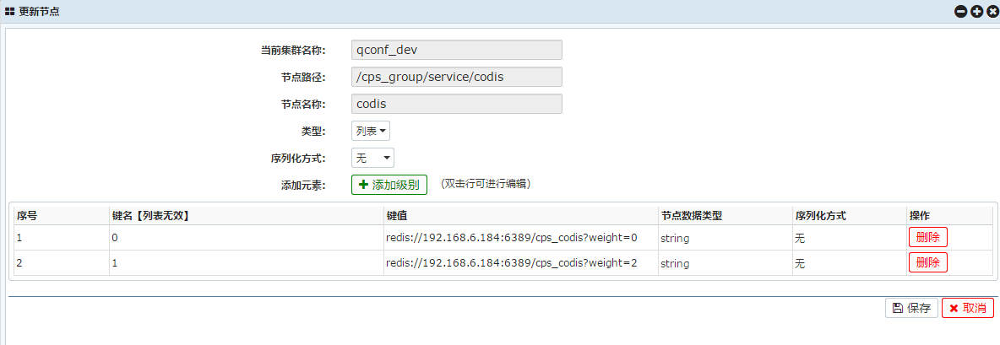
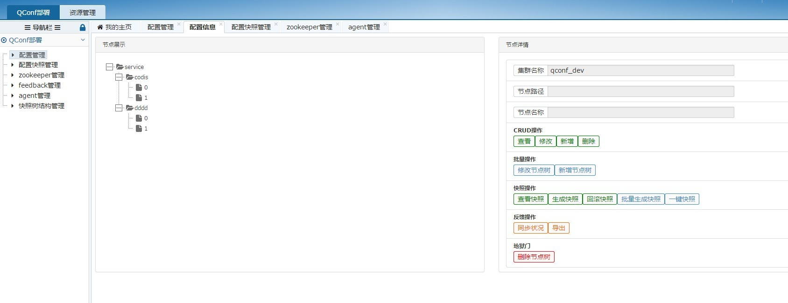

=======
zyredis yet another redis client that support failover and codis
=======
掌阅科技python接入redis客户端

项目描述
--------

- 实现redis接入以及redis的failover机制
- 实现redis客户端级别的负载均衡
- 解决长连接失效后需要重启服务问题
- 提供redis的基础model层
- 支持codis

项目当前状态
---------

- 服务线上所有redis的接入，日请求量大于5亿
- failover机制可以灵活切换redis proxy，并配置不同不服务器的负载

项目依赖
--------

- [QConf](https://github.com/Qihoo360/QConf)
- QConf python client目前已经集成到本目录代码中，zyredis/utils/qconf_py.so是通过QConf项目编译的python客户端
- [redis client](https://github.com/andymccurdy/redis-py)
- [Codis](https://github.com/wandoulabs/codis)

当前版本
--------

- v0.1.3 完全支持redis failover机制，兼容redis所有原生命令，python版本codis客户端，额外提供pythonic的数据结构

配置举例
--------



配置管理中心页面展示
--------



安装
--------

```
git clone https://github.com/ireaderlab/zyredis.git
cd zyredis
python setup.py install
```

使用举例
-------

qconf对应zookeeper配置项路径：/test_group/service/codis
该路径下节点codis0的值为：redis://localhost:6389/test_cache?weight=1
该路径下节点codis1的值为：redis://localhost:6339/test_cache?weight=3
该路径下节点codis2的值为：redis://localhost:6339/test_db?weight=1
该路径下节点codis3的值为：redis://localhost:6339/test_db?weight=2

这样的配置项目声明了两种proxy的客户端分别为用做缓存的test_cache和用做db的test_db
```
class BaseCacheModel(Model):

    client_name = "test_cache" # 声明使用的客户端名称
    db_num = 0
    zk_path = "/test_group/service/codis" # qconf对应的zookeeper路径

class BaseDbModel(Model):

    client_name = "test_db" # 声明使用的客户端名称
    db_num = 0
    zk_path = "/test_group/service/codis" # qconf对应的zookeeper路径

class TestCacheModel(BaseCacheModel):

    prefix = "wlctest"

    def set_key(self, arg1, arg2, val):
    	# redis key = wlctest_{arg1}_{arg2} 默认使用下划线连接
        self.db[self.key[arg1][arg2]] = val

    def set_key1(self, arg1, val):
    	# redis key = wlctest_{arg1}
        self.db.set(self.key[arg1], val)

    def get_key(self, arg1, arg2):
        return self.db[self.key[arg1][arg2]]

    def get_key1(self, arg1):
        return self.db.get(self.key[arg1])

class TestDbModel(BaseDbModel):

    prefix = "wlctest"

    def set_key(self, arg1, arg2, val):
    	# redis key = wlctest_{arg1}_{arg2} 默认使用下划线连接
        self.db[self.key[arg1][arg2]] = val

    def set_key1(self, arg1, val):
    	# redis key = wlctest_{arg1}
        self.db.set(self.key[arg1], val)

    def get_key(self, arg1, arg2):
        return self.db[self.key[arg1][arg2]]

    def get_key1(self, arg1):
        return self.db.get(self.key[arg1])
```

开源协议
-------
本软件使用FreeBSD协议开源，任何人可以使用或者修改代码，但是需保留Copyright信息
